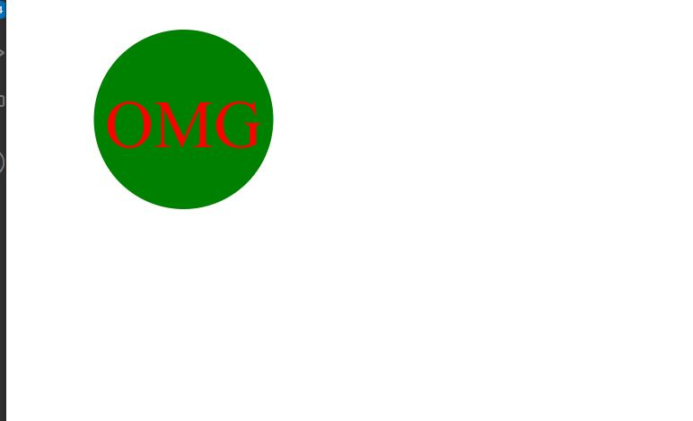
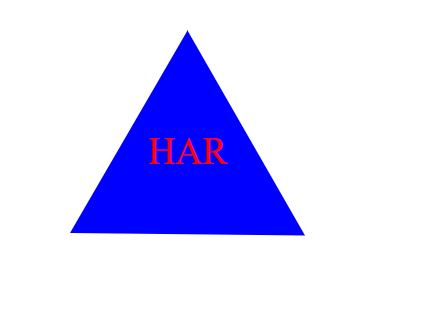

# Logo Generator

## _Table Of Contents_

1. [Description](#description)
2. [Usage](#usage)
3. [Installation](#installation)
4. [License](#license)
5. [Criteria For Assignment](#criteria-for-assignment)
6. [Repo Link](#repository-link)
7. [Example of Read Me](#example)
8. [Walkthrough Video](#walk-through-video)
9. [Screen Shots](#screen-shots)

## Description

For this project I was tasked with creating a logo generator. I would use node to have the user respond to prompts about what they wanted for their logo. The user is able to enter up to 3 letters, pick the color of the text, the shape (choosing between cricle triangle and square) and then picking the color of the shape to use. The user will be able to quickly use the this to create a logo. The user will be presented with an SVG file that will contain the logo once finished.

## Usage

The user will go through a series of prompts to create a logo. The logo with have up to 3 letters, will be able to pick between 3 shapes and choose the color of both the text and the shape. This will allow the user to save time creating a logo they can use for their business or website.

## Installation

You will need to use npm install for jest & inquierer after cloning the repo to install this project.

## License

MIT

_Website for license_

[MIT License Website](https://mit-license.org/)

## Criteria-for-assignment

GIVEN a command-line application that accepts user input

_WHEN I am prompted for text_
**THEN I can enter up to three characters**

_WHEN I am prompted for the text color_
**THEN I can enter a color keyword (OR a hexadecimal number)**

_WHEN I am prompted for a shape_
**THEN I am presented with a list of shapes to choose from: circle, triangle, and square**

_WHEN I am prompted for the shape's color_
**THEN I can enter a color keyword (OR a hexadecimal number)**

_WHEN I have entered input for all the prompts_
**THEN an SVG file is created named `logo.svg`**
**AND the output text "Generated logo.svg" is printed in the command line**

*WHEN I open the `logo.svg` file in a browser*
**THEN I am shown a 300x200 pixel image that matches the criteria I entered**

## Repository-Link

[Github](https://github.com/PintoDrop/logogen)

## Walk-Through-Video

[Logo Generator Walkthrough](https://drive.google.com/file/d/1MkFEvUNyy3_8ic_MU_gAC0cK6MhTD9eW/view)

## Screen-Shots

